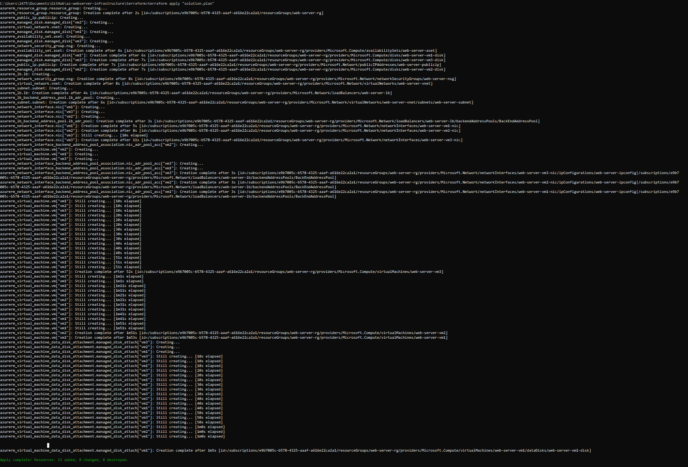

# Azure Infrastructure Operations Project: Deploying a scalable IaaS web server in Azure

### Scenario
Your company's development team has created an application that they need deployed to Azure. The application is self-contained, but they need the infrastructure to deploy it in a customizable way based on specifications provided at build time, with an eye toward scaling the application for use in a CI/CD pipeline.

Although Azure App Service could be used, management has said that <u>the cost is too high for a PaaS like that</u> and wants it to be deployed as pure IaaS so we can control cost. Since they expect this to be a popular service, it should be deployed across <b>multiple virtual machines</b>.

To support this need and minimize future work, <b> Packer will be used to create a server image</b>, and <b>Terraform to create a template for deploying a scalable cluster of servers - with a load balancer to manage the incoming traffic</b>. Moreover, the infrastructure will be secured <b>by applying security best practices</b>.

#### Main Steps
The project will consist of the following main steps:

1. Deploy the policy definition that denies the creation of resources without tags
2. Deploy the Packer image
3. Deploy the infrastructure using Terraform

### Dependencies
1. Create an [Azure Account](https://portal.azure.com) 
2. Install the [Azure command line interface](https://docs.microsoft.com/en-us/cli/azure/install-azure-cli?view=azure-cli-latest)
3. Install and configure [Packer](https://www.packer.io/downloads)
4. Install and configure [Terraform](https://www.terraform.io/downloads.html)

### Instructions

Login to your Azure Account via Terminal using `az login`, `cd` into your project folder and execute the following steps:

#### 1. Deploy the policy definition

1. Define the policy with  
```bash
az policy definition create --name tagging-policy --rules tagging-policy.rules.json
```  

2. Assign the policy with
```bash  
az policy assignment create --policy tagging-policy
```

The output should be similar to the following screenshot.  


#### 2. Deploy the Packer image
1. Create a resource group for the packer images named "images-rg" 
```bash 
az group create -n images-rg -l eastus
```

2. Create new Azure credentials using a service principal
```bash 
az ad sp create-for-rbac --query “{ client_id: appId, client_secret: password, tenant_id: tenant }”
```  

3. Query your azure subscription-id
```bash
az account show --query “{ subscription_id: id }”
```

4. Set the following environment variables via CLI provided by the previous outputs
```bash  
SET  CLIENT_ID=<YOUR_CLIENT_ID>    
SET  CLIENT_SECRET=<YOUR_CLIENT_SECRET>     
SET  SUBSCRIPTION_ID=<YOUR_SUBSCRIPTION_ID>
```

5. Deploy the packer image "ubuntuImage.json" providing the resource group you created in step 2.1  
```bash
packer build -var "managed_image_resource_group_name=images-rg" ubuntuImage.json
```  

#### 3. Deploy the infrastructure using Terraform
1. Check and change the **vars.tf** file depending on your demands
```tf
variable "prefix" {
    description = "The prefix that should be used for all resources"
    default = "web-server"
}
```

Variables can be used as follows
```tf
var.prefix
```
2. Change into the Terraform directory
```bash
cd terraform
```

3. Initialize the Terraform environment
```bash
terraform init
```
4. Run the Terraform deployment
```bash
terraform plan -out solution.plan
terraform apply "solution.plan"
```

5. Check the deployment via Azure Portal or via
```bash
terraform show
```

6. Finally destroy the infrastructure
```bash
terraform destroy
```
### Output


### License
MIT © [philbier]()